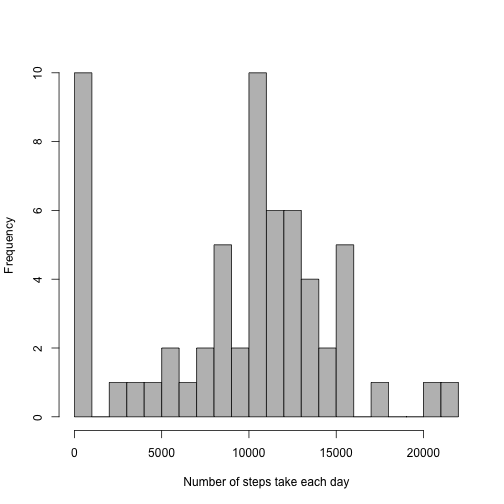

Reproducible Research: Peer Assessment 1
================================================

This report shows how to analyse a dataset containing recordings of the number of steps a person walked in 5 minute intervals during two months. Let's see what information we can get about the movement patterns of this guy.  

## Loading and preprocessing the data
As the data is in a zip file, we first need to unizip it. To do that I created a temporary file `temp` which stores the zip file. After unzipig the csv file we can get rid of the temporary file. 


```r
temp <- tempfile()
download.file("https://d396qusza40orc.cloudfront.net/repdata%2Fdata%2Factivity.zip", temp, method = "curl")
data <- read.csv(unz(temp, "activity.csv"))
unlink(temp)
```

Ok, now that we have the data, we need to process it a little bit to be able to use it in our analyses.  
First, lets create a new data frame called `daily_steps` that will make it easy to calculate the total, mean and median number of steps taken each day. There is probably a much more elegant way of doing this. If you have any ideas please let me know in the feedback box. 


```r
daily_steps <- data.frame(date = levels(data$date), steps = numeric(61))
for(i in 1:length(levels(data$date))){
  date_i <- subset(data, date == levels(data$date)[i])
  daily_steps[i,2] <- sum(date_i$steps, na.rm = T)
  rm(date_i)
}
```

Now, to analyze the average activity patterns within each day, let's create another data frame called `circadian`


```r
circadian <- data.frame(interval = levels(as.factor(data$interval)), steps = numeric(288))
for(i in 1:288){
  int_i <- subset(data, interval == circadian[i,1])
  circadian[i,2] <- mean(int_i$steps, na.rm = T)
  rm(int_i)
}
```

## What is the mean total number of steps taken per day?

Let's make a histogram of the total number of steps taken each day. 


```r
hist(daily_steps$steps, breaks=30, xlab="Number of steps take each day", col="gray", 
     main="")
```

 

Calculation of mean and median number of steps per day.

```r
mean_ds <- mean(daily_steps$steps, na.rm=T)
median_ds <- median(daily_steps$steps, na.rm=T)
```

The mean number of steps per day is **9354.2295082** and the median is **1.0395 &times; 10<sup>4</sup>**. 

## What is the average daily activity pattern?

Make a time series plot of the 5-minute interval (x-axis) and the average number of steps taken, averaged across all days (y-axis)

```r
plot(circadian$steps, type = "l", ylab="Number of steps", xlab = "5-min interval")
```

 

To find out the interval with the maximum average number of steps

```r
circadian[which(circadian$steps==max(circadian$steps)),]
```

```
##     interval    steps
## 104      835 206.1698
```


Thus, the maximum average number of steps, 206.1698113, was recorded in the interval 835.  

## Imputing missing values
Note that there are a number of days/intervals where there are missing values (coded as NA). The presence of missing days may introduce bias into some calculations or summaries of the data.  

1. Calculation of total number of missing values in the dataset.

```r
summary(data)
```

```
##      steps                date          interval     
##  Min.   :  0.00   2012-10-01:  288   Min.   :   0.0  
##  1st Qu.:  0.00   2012-10-02:  288   1st Qu.: 588.8  
##  Median :  0.00   2012-10-03:  288   Median :1177.5  
##  Mean   : 37.38   2012-10-04:  288   Mean   :1177.5  
##  3rd Qu.: 12.00   2012-10-05:  288   3rd Qu.:1766.2  
##  Max.   :806.00   2012-10-06:  288   Max.   :2355.0  
##  NA's   :2304     (Other)   :15840
```

From the summary of our data we can readily see that there are **2304** missing values.  

2. Let's fill in all the missing values in the dataset. We will use the mean number of steps for the corresponding 5-minute interval, which we can take from the `circadian` data frame, to fill in the missing value. The resulting dataset will be called `complete_data`.  


```r
complete_data <- data
for(i in 1:length(data$steps)){
  if(is.na(data[i,1])){
    int_i <- complete_data[i,3]
    complete_data[i,1] <- circadian[which(circadian$interval==int_i),2]
    rm(int_i)
  } 
}
```

Let's check if it worked.

```r
summary(complete_data)
```

```
##      steps                date          interval     
##  Min.   :  0.00   2012-10-01:  288   Min.   :   0.0  
##  1st Qu.:  0.00   2012-10-02:  288   1st Qu.: 588.8  
##  Median :  0.00   2012-10-03:  288   Median :1177.5  
##  Mean   : 37.38   2012-10-04:  288   Mean   :1177.5  
##  3rd Qu.: 27.00   2012-10-05:  288   3rd Qu.:1766.2  
##  Max.   :806.00   2012-10-06:  288   Max.   :2355.0  
##                   (Other)   :15840
```

Great! As you see, now there aren't missing values any more. Now, let's check if our first calculations of the total, mean and median number of steps per day change now that we filled in the missing values. I will start by creating a new data frame equivalent to `daily_steps`, but now based on `complete_data`. Let's call this new data frame `complete_ds`.


```r
complete_ds <- data.frame(date = levels(data$date), steps = numeric(61))
for(i in 1:length(levels(data$date))){
  date_i <- subset(complete_data, date == levels(data$date)[i])
  complete_ds[i,2] <- sum(date_i$steps, na.rm = T)
  rm(date_i)
}
```

Histogram of total number of steps taken each day.

```r
hist(complete_ds$steps, breaks=30, xlab="Number of steps taken each day", col="gray",
     main= "")
```

 

Now there are fewer days of total laziness (*i.e.*, with 0 total steps).  

Calculation of mean and median number of steps per day.

```r
mean_cds <- mean(complete_ds$steps, na.rm=T)
median_cds <- median(complete_ds$steps, na.rm=T)
```

The mean number of steps per day is **1.0766189 &times; 10<sup>4</sup>** and the median is **1.0766189 &times; 10<sup>4</sup>**. This means that **imputing missing data causes the average and median number of steps per day to increase by about 1412 and 371 steps, respectively**. 

## Are there differences in activity patterns between weekdays and weekends?

First, let's transform the date data from class factor to class date.

```r
complete_data[,2] <- as.Date(complete_data$date)
```

Add a new factor variable to the dataset, with two levels: "weekday" or "weekend".

```r
day <- vector(mode="character", length=17568)
for(i in 1:17568){
  if(weekdays(complete_data[i,2])=="Saturday" | weekdays(complete_data[i,2])=="Sunday"){
    day[i] <- "Weekend"
  } else {
    day[i] <- "Weekday"
  }
}
day <- as.factor(day)
complete_data$day <- day
```

To create a time series plot of the 5-minute intervals and the average number of steps taken, averaged over all weekdays and weekends, I'll first make two dataframes similar to `circadian` but based in the new data. One for weekdays, `circadian_wkd`, and one for weekends, `circadian_wkn`.


```r
circadian_wkd <- data.frame(interval = levels(as.factor(data$interval)), steps = numeric(288))
for(i in 1:288){
  int_i <- subset(complete_data, interval == circadian[i,1] & day == "Weekday")
  circadian_wkd[i,2] <- mean(int_i$steps, na.rm = T)
  rm(int_i)
}

circadian_wkn <- data.frame(interval = levels(as.factor(data$interval)), steps = numeric(288))
for(i in 1:288){
  int_i <- subset(complete_data, interval == circadian[i,1] & day == "Weekend")
  circadian_wkn[i,2] <- mean(int_i$steps, na.rm = T)
  rm(int_i)
}
```

Ok, now let's make those plots.

```r
par(mfrow=c(2,1), mar=c(0,1,0,1), oma=c(4,3,1,1))
plot(circadian_wkd$steps, type = "l", ylab="", xlab = "", xaxt="n", yaxt="n", lwd=2, 
     ylim=c(0,250))
axis(4)
text(0, 200, "Weekdays", font=2, pos=4, cex=1.2)
plot(circadian_wkn$steps, type = "l", ylab="", xlab = "", lwd=2, ylim=c(0,250))
text(0, 200, "Weekdends", font=2, pos=4, cex=1.2)
mtext("Interval", side=1, outer=T, line=2.5, cex=1.2)
mtext("Number of steps", side=2, outer=T, line=1.5, cex=1.2)
```

 
